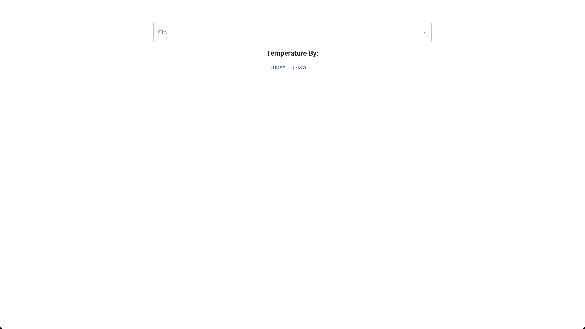

# Weather App

Needs to travel and wants to know the weather of this place? Weather App can help you.
The goal of this project is to helps you to discover the weather of a place. 

## How to use it:

When you access the Weather App, you'll see the home page. 

  

To see the temperature of a city, you must have to choose a city, in the City field. After choosing a City, you'll be able to see the Today Forecast or 5 Day Forecast.

  

In our example, we'll discoreved the Forecast for Blumenau city. 

Blumenau Forecast Today:

  

Blumenau 5 Day Forecast:

  

## Running the project:

First, you must have to install the dependencies. This project was created using Yarn, so I recommend you to use yarn:

    yarn

After installing the dependencies, run the project with the following command:

    yarn start